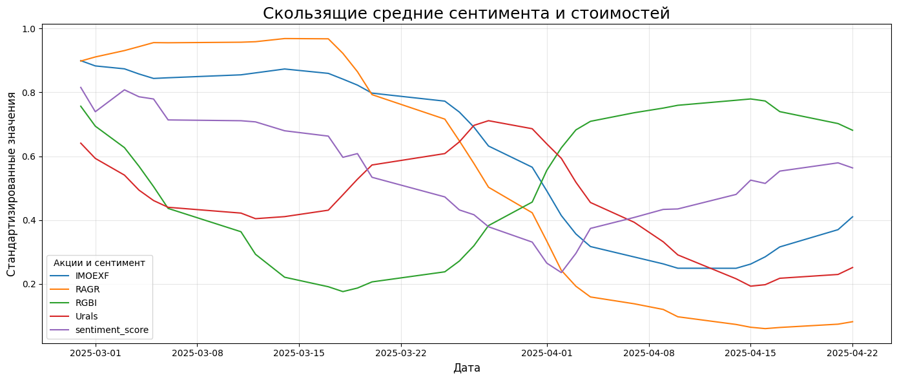

### <h2 style="font-size: 40px;">Влияние новостей на стоимость акций</h2>

#### Техническое задание 

Разработать модель для анализа сентимента новостей, связанных с компанией «Русагро», и оценить их влияние на динамику стоимости акций.

#### Описание данных

* **`ragr_news.xlsx`** - новости из различных источников с 1 января 2025 по 30 апреля, которые содержат любое упоминание о компании.
    - `story_id` - уникальный индентификатор новости
    - `story_date` - дата появления новости в 12-часовом формате
    - `title` - заголовок новости
    - `text` - содержание новости
    - `language` - отечественный или иностранный ресурс (ru/en)
    - `source` - ссылка на ресурс новости
    - `url` - ссылка на новость
    - `char_length` - количество символов в новости
    - `token_count` - количество слов в новости

* **`ragr_prices.xlsx`** - файл с дневными ценами закрытия по ценам акции Русагро (с 17 февраля 2025 года).
    - `TRADEDATE` - дата торгов
    - `RGBI` - доходность гос. облигаций
    - `IMOEXF` - динамика индекса рынка акций MOEX
    - `RAGR` - цена закрытия акции
    - `Urals` - стоимость нефти марки Юралз

Были устранены дубликаты, приведены даты к единому формату, исправлены артефакты в тексте новостей, такие как нарезанные слова. Пропуски в ценовых данных были аккуратно заменены на значение прошлого дня, выбросы устранены.

Большинство новостей содержат от 100 до 300 слов, и наблюдается тенденция к снижению стоимости акций. Совмещение новостного и ценового датасетов позволило создать выборку из 463 записей, пригодных для последующего анализа. 

Для оценки сентимента новостей была использована модель **rubert-tiny2-russian-financial-sentiment**, дообученная на финансовых текстах. Модель показала высокую способность к адекватной оценке контекста. Предсказанные оценки сентимента были объединены с рыночными данными и стандартизированы для анализа зависимости.

Корреляционный анализ, включая метрику Phik, показал умеренную зависимость между `sentiment_score` и `RAGR`. Также была зафиксирована корреляция между сентиментом и индексом `MOEX`, что дополнительно подтверждает значимость новостного фона в рыночной динамике. График скользящих средних выявил визуальную сонаправленность динамики сентимента и стоимости акций компании.

Для повышения точности прогноза рекомендуется расширить период, попробовать дообучить модель на размеченных данных.